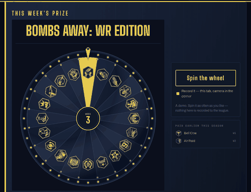
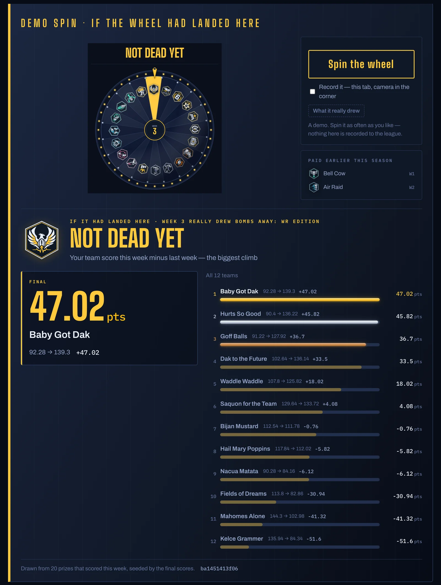
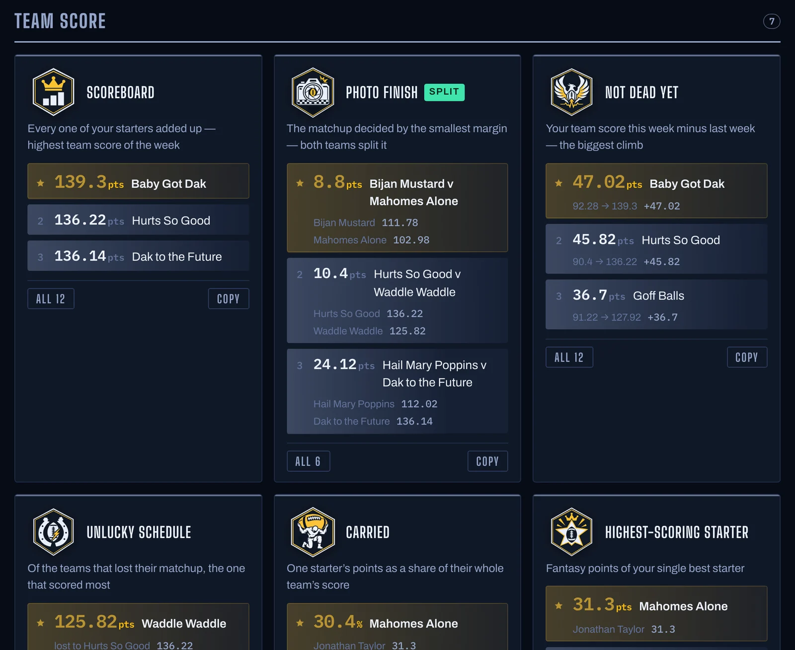
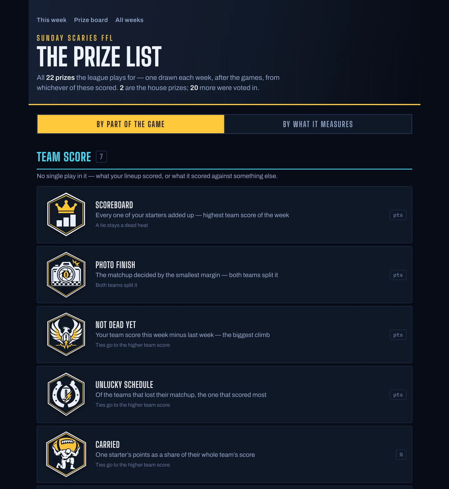
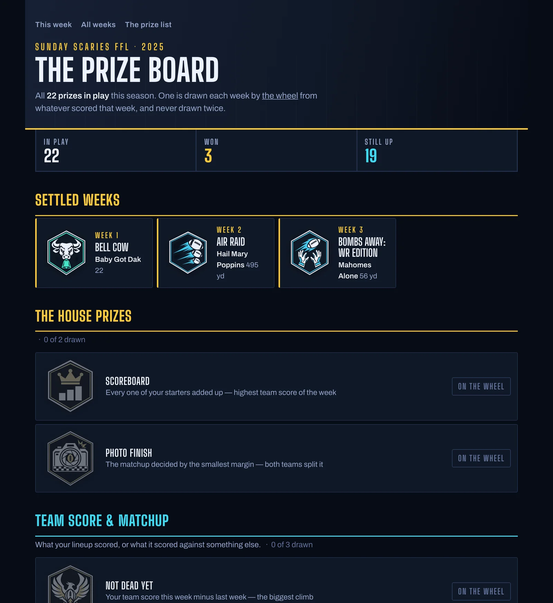
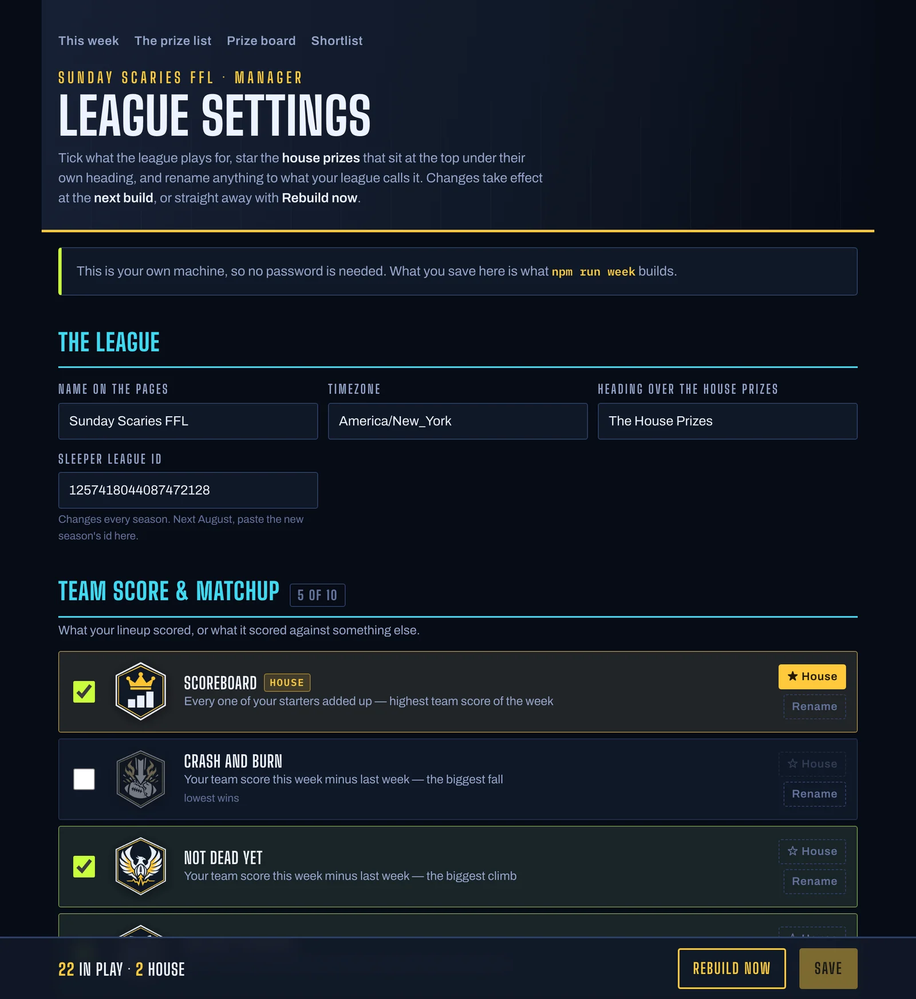
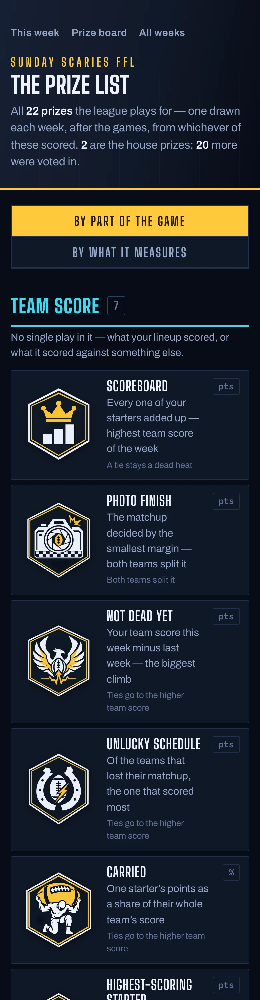

# 🏈 Sleeper Side Prizes

**Weekly side bets for your [Sleeper](https://sleeper.com) fantasy football league, handled.**

Every league has the main event. This is the sideshow: a little prize each week for something
glorious or embarrassing. Longest touchdown. Closest matchup. Most points left rotting on your
bench. This figures out who won **every one of them**, spins a wheel to decide which prize pays
out this week, and gives your league a page to argue about.

<p align="center">
  
</p>

Free. No Sleeper password. Nothing to install except one app. Your league-mates just get a link.

## 🎡 How it works

1. **You tell it your league.** One number from your Sleeper league's web address. It looks the
   league up and shows you your own teams back, so you know it found the right one.
2. **You pick your prizes.** There are **84** to choose from, from the classics to the petty.
   Rename any of them to your league's inside jokes.
3. **Every Tuesday it does the math.** It reads the lineups everyone *actually started* and the
   real box scores, and ranks every team for every prize. No spreadsheets, no scrolling twelve
   rosters in the app.
4. **Somebody spins the wheel.** One prize pays out each week, and nobody knows which until the
   spin. The pick is locked in before anyone can see it, so it cannot be rigged or re-rolled. Not
   even by the commissioner. Especially not by the commissioner.
5. **You settle up.** The site says who won. It never touches money; that part is still Venmo
   and trash talk.

## 👀 What your league sees

**The weekly page.** The wheel, what it landed on, and the full standings for that prize, with
the players who put the numbers there.

<p align="center"></p>

**Every other prize, scored anyway.** Just for bragging rights: who *would* have won each one.

<p align="center"></p>

| The prize list | The season board |
|---|---|
|  |  |
| What you play for, explained in one line each | What has been won, by whom, and what is still on the wheel |

| The manager's dashboard | On a phone |
|---|---|
|  | <p align="center"></p> |
| Tick prizes on and off, rename them, no code | Everything works on the thing people will actually open it on |

*(Team names in these pictures are made up. The numbers are a real week of football.)*

## 🏆 A taste of the 84 prizes

| | | |
|---|---|---|
| 👑 **Scoreboard** — highest score of the week | 📸 **Photo Finish** — closest matchup, both teams split it | 🧟 **Not Dead Yet** — biggest jump from last week |
| 🚀 **Bombs Away** — longest catch or completion | 🦵 **Big Leg** — longest field goal | 🐄 **Bell Cow** — most carries by one back |
| 🎒 **Carried** — one player's share of your whole score | 🪑 **Unsung Hero** — best player you left on the bench | 😬 **Unlucky Schedule** — best score that still lost |
| 🧱 **Brick Wall** — fewest yards allowed | 🙌 **Turnover Machine** — picks plus fumble recoveries | 💯 **Century Club** — most 100-yard starters |
| 🧈 **Butterfingers** — most fumbles | ⚰️ **Corpse In The Lineup** — the zero you started | 🧠 **Lineup IQ** — how close you got to your best lineup |

Shame prizes, projection prizes, kicker prizes, defense prizes. See them all with `node setup.js --list`, or on the dashboard.

## 🙋 Questions people ask

**Do I need to be technical?**
If you can install an app and copy a number, you can run it. Setup is one command that asks you
questions in plain English, and pressing Enter takes the suggested answer every time.

**Does it cost anything?**
No. It is free and open source. If you put it online, the hosting it uses has a free tier that a
fantasy league will never outgrow.

**Do I have to put it online?**
No. The commissioner can run it on a laptop, spin the wheel there, and drop the video in the
group chat. It records the spin for you. Putting it online just means everyone gets a link.

**Does it need my Sleeper password? Can it mess with my league?**
No and no. It only *reads* what Sleeper already shows publicly: lineups, scores and stats. It
cannot change anything.

**Can the wheel be rigged?**
No. The prize is chosen and locked the moment the week's page first loads, and a scrambled
fingerprint of it is published right then. When someone spins, the prize is revealed along with
the key that proves it matches that fingerprint. Nobody can swap it afterwards, and nobody can
peek early.

**Is this made by Sleeper?**
No. It is an independent fan project that uses Sleeper's public data. Not affiliated with or
endorsed by Sleeper.

---

# 🛠️ Setting it up

## Quick start

You need [Node.js](https://nodejs.org) (version 20 or newer; the installer's defaults are fine).
Nothing else — the project has no dependencies to install.

1. Get the code: the green **Code** button above, then **Download ZIP** and unzip it, or
   `git clone https://github.com/reedm121/sleeper-side-prizes.git`.
2. Open a terminal in that folder (on a Mac, right-click the folder and choose **New Terminal at
   Folder**; on Windows, shift-right-click and choose **Open PowerShell window here**).
3. Run one command:

```sh
npm start
```

It asks for your **Sleeper league id** — the long number in the address bar when you open your
league on sleeper.com, also shown under the league's settings in the app — looks the league up,
and shows you its name, teams, lineup and scoring so you know you typed the right one. Then it
asks a few more questions; **pressing Enter takes the answer shown in brackets** every time, so the
whole thing can be your league id and five Enters. Finally it builds a page from the newest
finished week and opens it in your browser, with your league's teams on it.

The questions, and what Enter gives you:

| Question | Enter means |
|---|---|
| Name to print on the pages | The league's name on Sleeper |
| Timezone | US Eastern |
| Prizes to play for | The **core** set: about twenty that settle cleanly and rarely tie. Or type numbers, ranges or ids from the list it prints (`1-8, 14, rec_yd`), or `all` |
| House prizes | None. These are prizes pinned at the top of every page under their own heading — the ones your league has always played for |
| Build a preview page now | Yes |

If your season has no finished week yet, the preview is last season's final week as a **demo**:
real numbers, but its wheel spins to a random prize on demand and records nothing.

Your answers are saved in `league.json`. Run `npm start` again any time to change them; it keeps
what you had as the defaults. Or edit the file — see below.

Once it looks right, [deploy it](#deploying) so the league can see it, and the Tuesday workflow
takes over from there.

## league.json

Everything that makes a deployment *your* league:

```json
{
  "league":     "123456789012345678",
  "name":       "New Ro FFL",
  "timezone":   "America/New_York",
  "houseLabel": "The House Prizes",
  "house":      ["high_score", "closest"],
  "prizes":     ["rec_yd", "pass_yd", "td_lng"],
  "custom":     { "rush_yd": { "name": "Run Forrest Run" } }
}
```

- `league` — this season's Sleeper league id. The `LEAGUE_ID` environment variable overrides it,
  so a workflow variable can point a deploy at next season without a commit, and `--league` on
  `build.js` overrides both for a backfill.
- `name`, `timezone` — the masthead and the clock the pages read dates in.
- `house` — prizes listed first under `houseLabel`. Can be empty.
- `prizes` — the rest of what you play for, or the string `"all"`.
- `custom` — your own `name` and/or `blurb` for any prize. The glossary calls `rush_yd`
  "Ground Game"; the league it was built for calls it "Run Forrest Run".

Edit it by hand or re-run `npm run setup`, which keeps your `custom` names.

## The manager's dashboard

`/admin` is the same choices as `league.json`, in a page: tick the prizes the league plays for,
star the **house** ones, rename any prize to what your league calls it, and set the name on the
masthead. The shortlist's votes show beside each prize, so the manager can see what the league
asked for while deciding.

What it saves lives in the site's store, and `config.js pull` writes it over `league.json` before
every build. So a change takes effect at the **next build**: Tuesday morning online, `npm run week`
on a laptop, or the **Rebuild now** button.

Who may save:

| Where it runs | Rule |
|---|---|
| Your laptop (`npm start`, `npm run week`) | Open. Whoever is at the keyboard is the manager |
| Deployed, `ADMIN_PASS` set | The password, typed once per browser tab |
| Deployed, no `ADMIN_PASS` | Locked. The page says what to set. Nobody reconfigures a league from a public URL because a step was skipped |

Reading is always open; what a league plays for is on `/prizes` anyway.

Environment variables, all optional:

| Variable | What |
|---|---|
| `ADMIN_PASS` | The manager's password. Or `ADMIN_PASS_SHA256` with its hash, if you would rather not paste the plain text into a dashboard field |
| `DEPLOY_HOOK` | A Vercel deploy hook URL (project **Settings → Git → Deploy Hooks**). Turns on **Rebuild now**; without it the Tuesday build picks changes up |
| `SITE_URL` | Only for the GitHub Actions workflow, and only until the first save from `/admin`, which records the site's address in `league.json` itself. Lets the Tuesday build fetch the manager's choices without database credentials |

`league.json` is still the source of truth for anyone who prefers a file: `node config.js push`
sends the file to the store, `node config.js pull` brings the store back to the file, and
`node config.js show` prints what a build would use.

## The glossary

`node setup.js --list` prints all 84. They are rows in [`awards.js`](awards.js), grouped:

| Group | Examples |
|---|---|
| Team score & matchup | Scoreboard, Not Dead Yet (biggest week-over-week climb), Unlucky Schedule (best losing score), Photo Finish (closest matchup, split), Curb Stomp, Shootout, Carried (one starter's share of the team), Flex Appeal |
| The big ones | Air Raid, Gunslinger, Ground Game, Yards From Scrimmage, Touchdown Club, Bell Cow, Longest Touchdown, Bombs Away (longest catch / longest completion), position rooms (QB / RB / WR / TE points), Century Club, Everybody Eats |
| Kickers & defense | Big Leg, Leg Day, Long Range, Turnover Machine, Sack Attack, Ball Hawks, Bend Don't Break, Brick Wall, Three And Out |
| Fun & degenerate | YAC Attack, Through Contact, Explosive Plays, Red Zone Hogs, First Blood, Going For Two, passer rating and yards-per rates with volume gates |
| Shame | The Basement, Butterfingers, Stone Hands, Sack Sponge, Picked Off, Wide Right, Corpse In The Lineup, Goose Eggs |
| Versus projection | Biggest Bust / Boom, Individual Bust / Boom — projections rescored with your league's settings |
| Lineup management | Unsung Hero (best benched player), Points Left On The Bench, Perfect Lineup, Lineup IQ, Deep Bench |

A prize is one row: how it aggregates (`sum`, `max`, `count`, `points`, `slot`, …), which stat
keys it reads, who is eligible, and when it should refuse to publish. Adding one is one row and
one test — see [CONTRIBUTING.md](CONTRIBUTING.md). **Ids are permanent**: they key the season
ledger, the sealed draws, the badge art and every shortlist vote. Names are free to change.

Every prize is computed from Sleeper's per-player box scores for the week, joined to each team's
starters *as they were locked that week* — not the current roster. Ties go to the higher team
score, or on a one-position prize to the higher-scoring player at that position; the prize list
prints the rule under each one. A stat that Sleeper did not chart league-wide that week voids
the prize rather than crowning everyone at zero.

## The wheel

One prize a week, drawn from the prizes that actually scored that week. Nobody sees it until
someone spins for it, and nobody can have swapped it afterwards:

1. The Tuesday build publishes the **pool** — every prize that scored — and what each would pay.
   Not the answer.
2. The first person to open the page **seals** the week: the server picks, salts it with a
   nonce, stores both, and publishes only `sha256(pick|nonce)`. The pick never leaves the server
   and never passes through CI.
3. Anyone can press **Spin the wheel**. That opens the week for everyone. The page can record the
   spin as a video with your camera in the corner, to drop in the group chat.
4. Anyone can hash the revealed pick and nonce and match the commitment that was public hours
   earlier.

There is no login, on purpose: the pick exists and is committed before anyone can press
anything, so a spin cannot choose it, change it or reroll it. The only thing a password would
decide is who gets to look first, which is a question about your group chat, not your server.

Without replacement: a prize drawn in week 3 is off the wheel for the rest of the season, and
`/awards` shows what is still up.

## You do not have to deploy it

A league can run this on the manager's laptop and never put it online. `npm start` once, then
each Tuesday:

```sh
npm run week
```

That finds the newest finished week, fetches headshots if Python and Pillow are installed,
builds the page, and opens it. The wheel works exactly as it does online — sealed the first time
the page loads, opened when you spin — against a file in `.data/` instead of a database, so the
spin is recorded and the season's no-repeat rule holds from week to week on that machine. Tick
**Record it** before you spin and you get a video of the spin to drop in the group chat, with your
camera in the corner if you like. Chrome only for the recorder.

What you give up by staying local: nobody else can open the page, the prize board and archive
live only on your machine, and the spin is the manager's alone rather than whoever gets there
first. What you skip: the next section entirely.

## Deploying

For a league that wants the pages online, the site is static pages plus two tiny API routes, built for [Vercel](https://vercel.com) with
an [Upstash](https://upstash.com) Redis store for the shortlist votes and the sealed draws.

1. Push your repository (with your `league.json`) to GitHub and import it at
   [vercel.com/new](https://vercel.com/new). `vercel.json` sets the build command and output
   directory; take the defaults.
2. In the project's **Storage** tab, create an Upstash Redis store (free tier) and connect it.
   That injects the REST URL and token; `lib/store.js` finds them by shape, whatever Vercel
   names them.
3. Under **Environment Variables**, set `ADMIN_PASS` to the manager's password so `/admin` can
   save. Optional: `DEPLOY_HOOK` from **Settings → Git → Deploy Hooks** for a Rebuild-now button.
4. Redeploy. Without a store, `/api/state`, `/api/wheel` and `/api/config` return 503 and the
   pages say so rather than pretending to save.

### The Tuesday workflow

[`.github/workflows/weekly.yml`](.github/workflows/weekly.yml) runs at 05:05 ET every Tuesday, with retries at 07:05 and 10:05:
find the newest finished week, fetch headshots, build the page, commit it to `weeks/`. The push
triggers the Vercel deploy, so there is no deploy hook or token to keep in sync. It reads the
league from `league.json`; set a repository variable `LEAGUE_ID` to override it when the season
rolls over. `workflow_dispatch` takes a week and season to backfill by hand.

GitHub disables scheduled workflows on public repositories after 60 days without a commit.
Re-enable it each August.

### Local

```sh
npm run build && npm run dev    # public/ + the real API handlers against a file store in .data/
HTTPS=1 npm run dev             # a self-signed https address on your LAN, so a phone will grant a camera
npm test                        # glossary shape, every aggregation, the shortlist merge, the wheel, the seal
```

## Data and credit

- **Sleeper's public API.** The documented league endpoints on `api.sleeper.app` and the
  undocumented stats, projections and schedule endpoints on `api.sleeper.com`. Read-only, no
  key. The undocumented ones could change without notice; a finished week is cached forever in
  `.cache/` so a backfill never depends on them twice.
- **nflverse** ([nflverse-data](https://github.com/nflverse/nflverse-data), CC BY 4.0) for
  play-by-play — one prize, Now Watch This Drive, needs drive length, which Sleeper does not
  carry — and for kickoff times. Both are optional: without them that prize voids and the race
  under the wheel runs by game day.
- **DynastyProcess** ([db_playerids](https://github.com/dynastyprocess/data)) to map nflverse
  player ids to Sleeper's.
- Player headshots and club marks are fetched from Sleeper's CDN at build time by `assets.py`,
  which is optional. They are inlined into a week's page, not committed on their own.
- The badge artwork in `output/badges/` was drawn for the original league and is MIT like the
  code. Prizes without art render without it.

## Layout

```
league.json     your league: id, name, timezone, which prizes           <- the only file you edit
setup.js        writes league.json by asking questions
build.js        one week -> weeks/<season>-week-<n>.html
  sleeper.js      API client; a finished week caches forever, an unfinished one never
  drives.js       nflverse play-by-play, for the one prize Sleeper cannot answer
  compute.js      rosters + raw stats -> per-team boards for every prize
  awards.js       the glossary, and what this league plays for out of it (from league.json)
  render.js       boards -> one HTML page per week
  wheelui.js      the wheel and the race under it (client-side, inlined by render.js)
  badges.js       badge art, for every page that names a prize
  lib/league.js   reads league.json
assets.py       headshots and club marks -> assets.json (optional; needs Pillow)
badges.py       badge art -> output/badges/web/ (committed)

site.js         weeks/ + the other pages -> public/; newest week becomes /
master.js       the prize board: what is in play, what has been won
prizes.js       the prize list
shortlist.js    the checklist of prizes not yet played for
admin.js        the manager's dashboard
config.js       store <-> league.json; `pull` runs before every build
api/config.js   read and save the manager's settings; rebuild
lib/admin.js    who may save: password from the environment, or open on a laptop
lib/ids.js      renamed prize ids and the aliases that keep old ones resolving
api/wheel.js    seal a week's prize; open it when someone spins
api/state.js    the shortlist's shared votes
lib/store.js    Upstash in production, a file in dev
dev.js          local preview with working API routes
wheel.json      the season ledger: what each week drew and who won it
test/           npm test
scripts/        screenshots.mjs + gif.py: retake the README's pictures (fake team names, no faces)
```

[PLAN.md](PLAN.md) is the original design investigation — why the API beats scraping, and the
Sleeper quirks every rule in `compute.js` was earned against. Worth reading before touching the
scoring.

## Keeping up with the template

If you cloned this to run your own league, your repository is the template plus three things of
your own: `league.json`, `weeks/`, and `wheel.json` (and whatever the manager saved on `/admin`,
which lives in your store, not in git). Pull the template to pick up new prizes and
fixes; those three files are never in it, so the merge cannot touch them:

```sh
git remote add template https://github.com/reedm121/sleeper-side-prizes.git   # once
git pull template main
```

## License

MIT. See [LICENSE](LICENSE).
